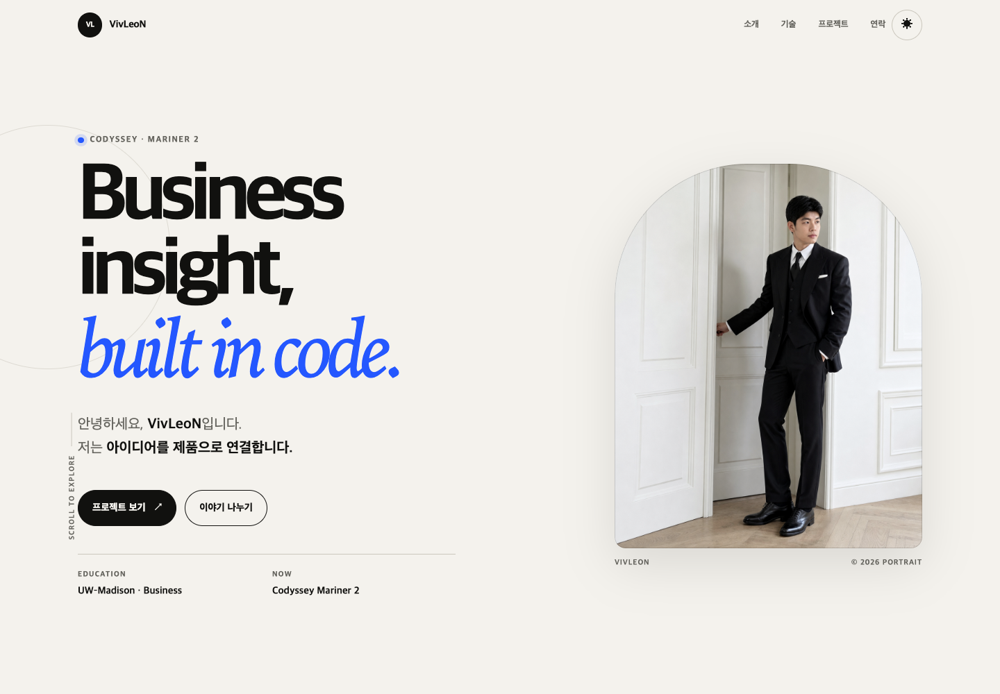
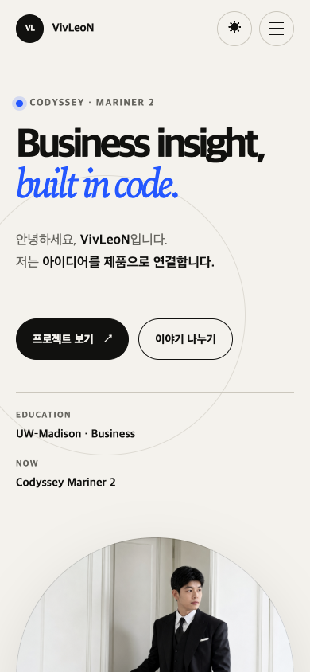
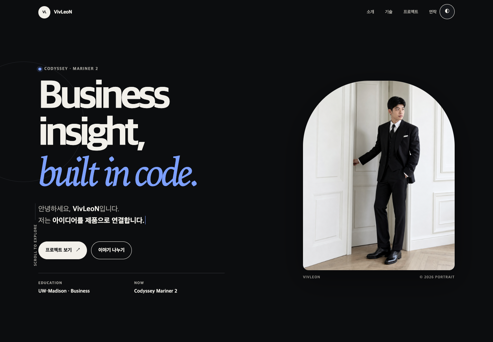

# VivLeoN Portfolio

비즈니스와 기술을 연결하며 성장하는 VivLeoN의 반응형 포트폴리오입니다. 외부 UI 프레임워크 없이 순수 HTML, CSS, JavaScript로 구현했으며 GitHub REST API를 통해 공개 저장소를 실시간으로 표시합니다.

## 배포 주소

- Website: <https://vivleon.github.io/vivleon-portfolio/>
- Repository: <https://github.com/vivleon/vivleon-portfolio>
- LinkedIn: <https://www.linkedin.com/in/vivranium/>

## 주요 기능

- Hero, About, Experience, Skills, Projects, Contact, Footer 시맨틱 섹션
- LinkedIn 이력을 바탕으로 구성한 경력 타임라인과 학력 정보
- 모바일 퍼스트 반응형 레이아웃: 768px 태블릿, 1024px 데스크톱
- 모바일 햄버거 메뉴와 앵커 부드러운 스크롤
- 라이트/다크 모드 전환 및 `localStorage` 설정 유지
- 시스템 색상 모드(`prefers-color-scheme`) 자동 감지
- 스크롤 60px 이후 헤더 스타일 변경
- 스크롤 300px 이후 맨 위로 이동 버튼 표시
- `IntersectionObserver` 기반 스크롤 등장 애니메이션 (`threshold: 0.2`)
- GitHub API 프로젝트 로딩/성공/에러/빈 상태 및 재시도
- GitHub 저장소 사용 언어별 프로젝트 필터
- Hero 타이핑 애니메이션
- 문의 폼 실시간 유효성 검사와 Formspree 비동기 전송
- 모션 감소 환경(`prefers-reduced-motion`) 지원

## 사용 기술

- HTML5: 시맨틱 마크업, 접근 가능한 폼과 내비게이션
- CSS3: Custom Properties, Flexbox, Grid, Media Query, Transition
- JavaScript ES6+: DOM API, Fetch, async/await, 구조분해 할당, 배열 메서드
- GitHub REST API
- Formspree 비동기 폼 전송
- GitHub Pages

## 폴더 구조

```text
vivleon-portfolio/
├── index.html
├── css/
│   └── style.css
├── js/
│   └── script.js
├── images/
│   └── profile.png
├── docs/
│   └── screenshots/
├── tests/
│   └── validate.mjs
└── README.md
```

## 실행 및 검증

VS Code의 Live Server를 사용하거나 다음과 같이 정적 서버를 실행합니다.

```bash
python3 -m http.server 4173
```

브라우저에서 <http://localhost:4173>을 엽니다. 정적 요구사항 검사는 Node.js로 실행할 수 있습니다.

```bash
node tests/validate.mjs
```

## 핵심 개념 설명

### 시맨틱 태그를 사용하는 이유와 구조 기준

`header`, `nav`, `main`, `section`, `article`, `footer`가 콘텐츠의 역할을 브라우저와 보조 기술에 전달합니다. 이 페이지는 전역 내비게이션은 `header/nav`, 독립적인 주제 단위는 `section`, 반복되는 프로젝트와 원칙은 `article`, 마무리 정보는 `footer`로 구분했습니다.

### Flexbox와 Grid를 선택한 기준

Flexbox는 한 방향으로 정렬하는 데 적합하므로 로고와 메뉴를 좌우에 배치하는 내비게이션, 버튼 그룹에 사용했습니다. Grid는 행과 열을 함께 다루는 데 적합하므로 화면 너비에 따라 카드 수가 달라지는 Projects에 `repeat(auto-fit, minmax(...))`로 사용했습니다.

### DOM 선택과 이벤트 연결

`querySelector`와 `querySelectorAll`로 문서의 요소를 선택하고, HTML의 `onclick` 속성 대신 `addEventListener`로 `click`, `submit`, `scroll`, `input` 이벤트를 연결했습니다. 이벤트가 발생하면 상태를 변경한 뒤 `textContent`, `innerHTML`, `classList`를 이용해 화면을 갱신합니다.

### ES6+ 문법과 배열 메서드

함수는 화살표 함수로 정의하고, GitHub 저장소 객체는 구조분해 할당으로 필요한 속성을 꺼냅니다. `map`은 저장소 배열을 카드 HTML로 변환하고, `filter`는 fork/보관 저장소 제외 및 언어별 필터링에 사용하며, `forEach`는 여러 DOM 요소에 이벤트나 애니메이션을 적용할 때 사용합니다.

### 비동기 데이터와 상태 UI

`fetch`와 `async/await`로 `https://api.github.com/users/vivleon/repos`를 호출합니다. 요청 직전에는 로딩 상태, 성공하면 카드 목록, 결과가 없으면 빈 상태, 네트워크 오류나 API 제한(403)이 발생하면 에러와 재시도 버튼을 렌더링합니다. 인증하지 않은 GitHub API는 시간당 60회 제한이 있으므로 반복 새로고침을 피합니다.

### 이벤트 → 상태 → 렌더링 흐름

1. 테마 버튼 클릭 → 테마 상태 및 `localStorage` 변경 → CSS 변수 기반 전체 색상 변경
2. GitHub API 요청 → 로딩/성공/에러/빈 상태 변경 → Projects UI 재렌더링
3. 입력 이벤트와 제출 → 필드 유효성 상태 변경 → 필드별 오류 또는 전송 결과 표시
4. 언어 필터 클릭 → 선택 언어 상태 변경 → `filter()` 결과 카드와 개수 갱신
5. 햄버거 버튼 클릭 → 메뉴 열림 상태 변경 → `active` 클래스와 접근성 속성 갱신

## 보너스 과제

- 프로젝트 필터링: GitHub 저장소의 `language` 값을 기준으로 동적 버튼 생성
- 타이핑 효과: 여러 소개 문구를 글자 단위로 입력하고 지우는 애니메이션
- 폼 실제 전송: 발급된 Formspree 엔드포인트로 `FormData`를 비동기 전송
- 시스템 다크 모드: 저장된 사용자 선택이 없을 때 운영체제 설정을 초기 테마로 사용

Formspree 폼 ID `xoeqldwy`를 연결했습니다. JavaScript가 기본 제출을 가로채 유효성을 검사한 뒤 비동기로 전송하며, 성공·실패 결과를 페이지 안에서 안내합니다.

## 스크린샷

### 데스크톱



### 모바일



### 다크 모드



## 접근성

- 모든 의미 있는 이미지에 대체 텍스트 제공
- 모든 입력 요소와 `label`의 `for`–`id` 연결
- 키보드 포커스 표시와 본문 바로가기 링크
- 동적 결과에 `aria-live`, 토글에 `aria-expanded`/`aria-pressed` 제공
- 모션 감소 설정 시 애니메이션 최소화

## 저작권

프로필 사진과 개인 콘텐츠의 저작권은 VivLeoN에게 있습니다.
